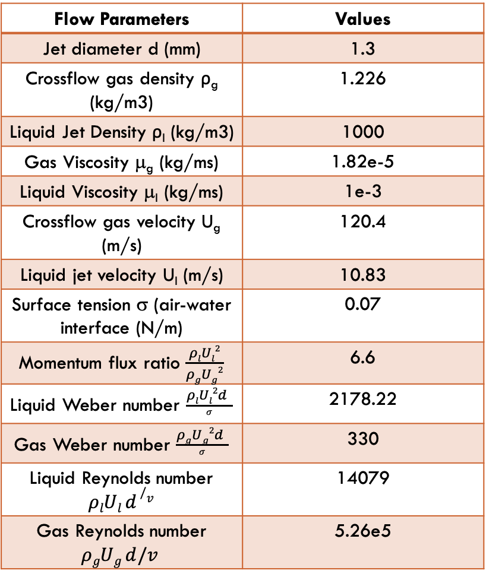

# Multiphase simulations of liquid jet in crossflow in OpenFOAM

This repository contains files for incompressible, multiphase simulations of 
a liquid jet in crossflows

# Simulations
Direct numerical simulations and Reynolds Averaged Navier-Stokes (RANS) simulations  

   

    

    
